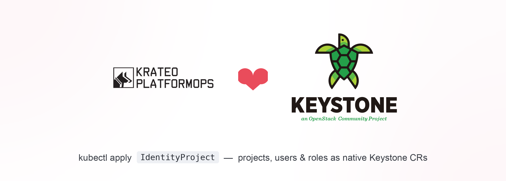

<p align="center">
  
</p>

> 📖 **[Quickstart](docs/quickstart.md)** — install the operator and see a resource appear in Horizon.


# openstack-keystone-operator-kog

Krateo Operator Generator (KOG) packaging that turns **OpenStack Keystone (identity v3)**
resources into native Kubernetes custom resources — no hand-written controller, just a
hand-curated OpenAPI subset per resource and a generic `rest-dynamic-controller`.

`kubectl apply` an `IdentityProject` / `IdentityUser` / … CR &rarr; KOG's
[`oasgen-provider`](https://github.com/krateoplatformops/oasgen-provider) +
[`rest-dynamic-controller`](https://github.com/krateoplatformops/rest-dynamic-controller)
reconcile it into a real Keystone object.

## Resources

| Kind | Keystone API | Verbs | Default |
|------|--------------|-------|---------|
| `IdentityProject` | `/v3/projects` | create / get / update / delete | ✅ on |
| `IdentityUser` | `/v3/users` | create / get / update / delete | ✅ on |
| `IdentityRole` | `/v3/roles` | create / get / update / delete | ✅ on |
| `IdentityDomain` | `/v3/domains` | create / get / update / delete* | ✅ on |
| `IdentityRoleAssignment` | `PUT/DELETE /v3/projects/{p}/users/{u}/roles/{r}` | grant / revoke (idempotent) | ✅ on |
| `IdentityGroup` | `/v3/groups` | create / get / update / delete | ⚠️ off — crdgen quirk |
| `IdentityApplicationCredential` | `/v3/users/{u}/application_credentials` | create / get / delete | ⚠️ off — body-leak |
| `IdentityFederationProvider` | `/v3/OS-FEDERATION/identity_providers/{id}` | create / get / update / delete | ✅ on |
| `IdentityMapping` | `/v3/OS-FEDERATION/mappings/{id}` | create / get / update / delete | ✅ on |
| `IdentityFederationProtocol` | `/v3/OS-FEDERATION/identity_providers/{idp}/protocols/{id}` | create / get / update / delete | ✅ on |

Validated end-to-end against a Krateo-blueprint Keystone: `IdentityProject`, `IdentityUser`,
`IdentityRole` create real objects (HTTP 201) and `IdentityRoleAssignment` grants a role
(`PUT … → 204`, verified with `openstack role assignment list`). Two resources ship **disabled**
(`restdefinitions.<r>.enabled: false`) with documented limitations — see *Caveats*.

Each Keystone payload is envelope-wrapped (`{project:{…}}`, `{user:{…}}`, …), so every Kind is
prefixed `Identity*` to avoid the crdgen Kind-vs-property collision (the same reason Nova's
`Server` → `Instance`). Unlike Nova/Ironic, Keystone updates are plain `PATCH` (not JSON-Patch),
so CRUD resources carry an `update` verb. *Domains must be disabled (`enabled:false`) before they
can be deleted — `update` first, then `delete`.

## Federation (OS-FEDERATION)

The three `IdentityFederation*` / `IdentityMapping` kinds make Keystone's OIDC/SAML
federation trust GitOps-native — declare an external IdP, a claims→identity mapping,
and the protocol binding as CRs instead of hand-running `openstack federation …`.
This was validated **live end-to-end** (GitHub → Keycloak → Keystone → Horizon,
federated user auto-provisioned into a project). See
[`chart/samples/federation.yaml`](chart/samples/federation.yaml).

Unlike projects/users (POST → server UUID), a federation object is addressed by a
**client-chosen id** in the path (`PUT`), so `id` is a user-set natural-key spec field
— no `findby` needed. Four Keystone-specific gotchas the samples encode:

- **Update is `PATCH`, not `PUT`.** Keystone's `PUT /OS-FEDERATION/.../{id}` is
  create-only and returns **409** if the object exists; the `update` verb maps to PATCH.
- **No `domain` in the mapping's `projects` local rule** — Keystone rejects it; the
  project domain is inferred from the `user` rule.
- **Pin the IdP's `domain_id`** to your managed domain, or Keystone auto-creates a
  per-IdP domain and auto-provisioned projects land there, orphaned. Pinning it makes
  auto-provisioning **reuse** the managed project (matched by name in that domain).
- Recreating an IdP with the same id needs stale **shadow-user cleanup** in the
  federation domain (otherwise re-login hits `409 store federated_user - Duplicate`).

## Auth: the openstacksdk proxy (auto-refreshing)

KOG's controller speaks plain HTTP and can't do Keystone token exchange. This chart ships a small
**auth-bridge** (`scripts/openstack-auth-proxy.py` in the openstack-client image): it authenticates
with a `clouds.yaml`, discovers the `identity` endpoint, and injects a **fresh** `X-Auth-Token` on
every call (keystoneauth refreshes it automatically). Unlike a static-token nginx rewrite it never
expires and works in-cluster (no public-DNS resolver trap). The OAS `servers[0].url` points the
generated controllers at it.

You supply the admin `clouds.yaml` in a Secret:

```bash
kubectl create secret generic keystone-clouds --from-file=clouds.yaml=clouds.yaml -n krateo-system
```

> Bootstrapping note: an `IdentityApplicationCredential` is the production answer to the
> expiring-token problem the other KOG operators (nova/ironic) hit — mint one here, then point
> their proxies/clouds.yaml at it.

## Quickstart

```bash
helm repo add krateo https://charts.krateo.io && helm repo update
helm upgrade --install oasgen-provider krateo/oasgen-provider -n krateo-system --create-namespace

kubectl create secret generic keystone-clouds --from-file=clouds.yaml=clouds.yaml -n krateo-system
helm upgrade --install keystone-kog ./chart -n krateo-system \
  --set authBridge.upstreamEndpoint=http://keystone-api.openstack.svc.cluster.local:5000/v3

kubectl -n krateo-system apply -f chart/samples/identity-resources.yaml
kubectl -n krateo-system get identityprojects.identity.openstack.krateo.io -w
```

## What's in here

```
chart/
  Chart.yaml
  values.yaml                 # per-resource toggles + auth-bridge config
  assets/                     # one Keystone OAS subset per resource
    project.yaml user.yaml role.yaml group.yaml domain.yaml
    role-assignment.yaml application-credential.yaml
  scripts/
    openstack-auth-proxy.py   # openstacksdk Keystone-auth reverse proxy
  templates/
    configmap-*.yaml          # bundle each OAS into a ConfigMap
    rd-*.yaml                 # one RestDefinition per resource (toggle via values)
    auth-bridge-*.yaml        # the auth proxy Deployment/Service/ConfigMap
  samples/
    identity-resources.yaml   # example CRs (Configuration + Project/User/Role/…)
```

## Notes / caveats

- **`IdentityGroup` (off by default):** crdgen emits an undefined Go type `Group` for the `group`
  envelope property and fails CRD generation (`unknown type Group`) — the literal property name
  `group` is the trigger (reproduced with both `$ref` and inlined schemas). The OAS + RestDefinition
  ship ready to enable once the upstream crdgen issue is fixed.
- **`IdentityApplicationCredential` (off by default):** create is
  `POST /v3/users/{user_id}/application_credentials` with a body of strictly
  `{application_credential:{…}}`, but KOG sends the whole spec, so the path-only `user_id` leaks into
  the body and Keystone returns 400 (verified). The CRD generates and get/delete work; clean create
  needs a KOG exclude-from-body mapping (the same caveat as Nova's quota set). App credentials are
  the production answer to expiring tokens, so this is the highest-value follow-up.
- `IdentityRoleAssignment` is an idempotent grant (PUT/DELETE on a composite path), modeled as a
  single CR; re-firing the PUT is a harmless no-op. Validated: `PUT … → 204`.
- `IdentityDomain` must be disabled (`update` with `enabled:false`) before it can be deleted.

## License

Apache-2.0 — see [LICENSE](LICENSE).
