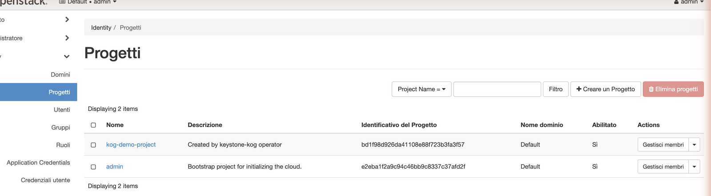

# Quickstart — Keystone (identity) operator

Manage OpenStack **Keystone** identity resources as Kubernetes CRs. End to end:
install the operator, `kubectl apply` an `IdentityProject`, and watch it appear in
the Horizon dashboard.

## 1. Prerequisites

Krateo's KOG provider in the cluster:

```bash
helm repo add krateo https://charts.krateo.io && helm repo update
helm upgrade --install oasgen-provider krateo/oasgen-provider -n krateo-system --create-namespace
```

An admin `clouds.yaml` for your Keystone, stored in a Secret:

```bash
kubectl -n krateo-system create secret generic keystone-clouds --from-file=clouds.yaml=clouds.yaml
```

```yaml
# clouds.yaml
clouds:
  openstack:
    auth:
      auth_url: http://keystone-api.openstack.svc.cluster.local:5000/v3
      username: admin
      password: password
      project_name: admin
      user_domain_name: Default
      project_domain_name: Default
    region_name: RegionOne
    identity_api_version: 3
    interface: internal
```

## 2. Install the operator

```bash
helm upgrade --install keystone-kog ./chart -n krateo-system \
  --set authBridge.upstreamEndpoint=http://keystone-api.openstack.svc.cluster.local:5000/v3
kubectl -n krateo-system wait restdefinition/keystone-kog-project --for=condition=Ready --timeout=300s
```

## 3. Create a project

The auth-bridge injects a fresh token, so the bearer token below is just a placeholder.

```bash
kubectl -n krateo-system create secret generic keystone-token --from-literal=token=managed-by-proxy
cat <<'EOF' | kubectl apply -f -
apiVersion: identity.openstack.krateo.io/v1alpha1
kind: IdentityProjectConfiguration
metadata: {name: keystone-config, namespace: krateo-system}
spec: {authentication: {bearer: {tokenRef: {name: keystone-token, namespace: krateo-system, key: token}}}}
---
apiVersion: identity.openstack.krateo.io/v1alpha1
kind: IdentityProject
metadata: {name: kog-demo-project, namespace: krateo-system}
spec:
  configurationRef: {name: keystone-config, namespace: krateo-system}
  project:
    name: kog-demo-project
    domain_id: default
    description: "Created by keystone-kog operator"
    enabled: true
EOF
kubectl -n krateo-system get identityproject kog-demo-project -w
```

## 4. See it in Horizon

The project the operator created appears under **Identity → Projects** — note the
description and that the Identity menu exposes every resource the operator manages
(Domains, Projects, Users, Groups, Roles, Application Credentials):



Apply `IdentityUser`, `IdentityRole` and `IdentityRoleAssignment` the same way to
manage users, roles, and grants.
